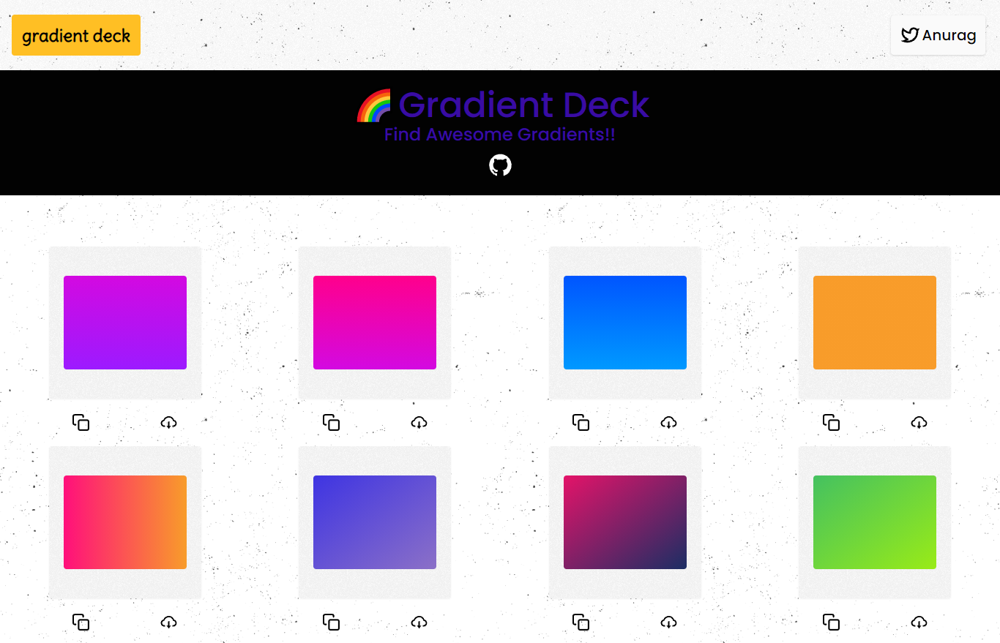

<h2 align="center"> 🌈 Gradient Deck - Find Awesome Gradients 🌈 </h2>

<p align='center'>
    <a href="https://gradient-deck.vercel.app/"></a></p>


<h3 align="center"><a href="https://gradient-deck.vercel.app/">Try it Out</a></h3>

<h2>💡 What is Gradient Deck?</h2>
<h3>
    🔥 Gradient Deck is a tool made by <a href="#">Anurag</a> for developers and designers to find awesome gradients!!
</h3>

<h2>🍉 Features:</h2>
<h3><li>Curated list of awesome gradients</li></h3>
<h3><li>Copy gradient CSS Code</li></h3>
<h3><li>Download Gradient as Image</li></h3>
<h3><li>PWA</li></h3>
<h3><li>Fully Responsive 💻</li></h3>
<h3><li>Open Source</li></h3>

<h2>⚙ How it's made?</h2>
<h3><li>Next JS</li></h3>
<h3><li>Tailwind CSS</li></h3>
<h3><li>react-hot-toast</li></h3>
<h3><li>Material UI</li></h3>
<h3><li>react-icons</li></h3>
<h3><li>html2canvas</li></h3>
<h3><li>Framer Motion</li></h3>

<h2>Cloning/Installation Steps:</h2>

<h3>Clone the repo</h3>

```
git clone https://github.com/kr-anurag/gradient-deck
```

<h3>Change the directory</h3>

```
cd gradient-deck
```

<h3>Install the required modules</h3>

```
npm install
```

<h3>Run the app</h3>

```
npm run dev

// or if you use yarn
yarn dev
```

<h2>Contributing:</h2>

<h3>Head over to the <kbd>data.json</kbd> file and add the desired gradient:</h3>

> Make sure to add the required fields in the below form:

```
{
  "colors": [
    "linear-gradient(180deg, #d309e1 0%, rgb(156, 26, 255) 100%)"
  ]
}
```

<h3>Make a PR</h3>

<h3>There you go!! That's it!</h3>

<h2>About Me:</h2>
<h3>Hey👋🏻, I'm Anurag, a 14 y/o developer based in India</h3>

<h2>Connect with me:</h2>
<a href="https://twitter.com/kr_anurag_">Twitter</a> <br>
<a href="https://github.com/kr-anurag">Github</a>
