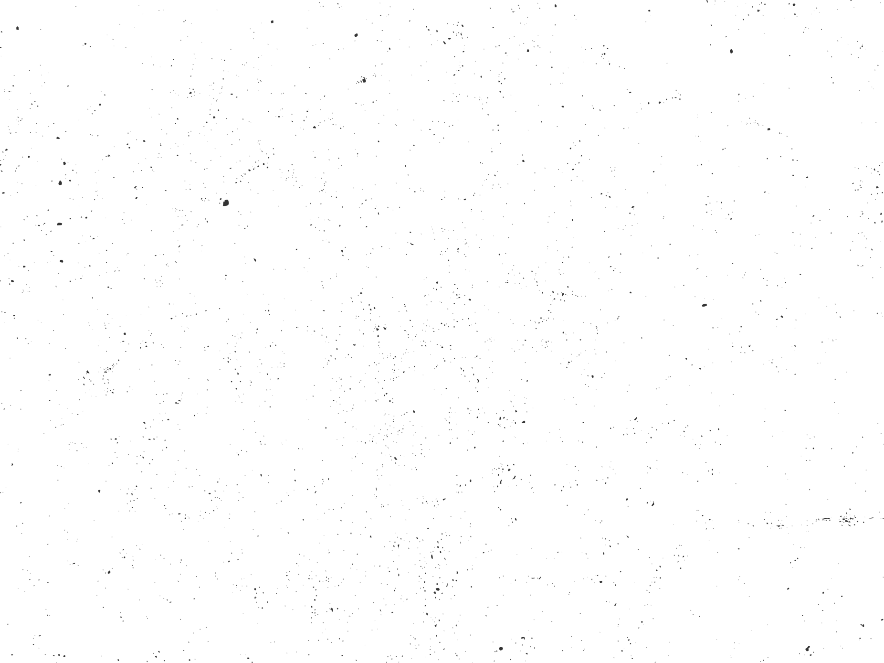

<h2 align="center"> 🌈 Gradient Deck - Find Awesome Gradients 🌈 </h2>


<h3 align="center"><a href="#">Try it Out</a></h3>

<h2>💡 What is Gradient Deck?</h2>
<h3>
    🔥 Gradient Deck is a tool made by <a href="#">Anurag</a> for developers and designers to find awesome gradients!!
</h3>

<h2>Features:</h2>
<h3><li>Curated list of awesome gradients</li></h3>
<h3><li>Copy gradients</li></h3>
<h3><li>Open Source</li></h3>
<h3><li>Fully Responsive 💻</li></h3>

<h2>⚙ How it's made?</h2>
<h3>Next JS</h3>
<h3>Tailwind CSS</h3>
<h3>Firebase (for authentication)</h3>
<h3>react-firebase-hooks</h3>
<h3>react-hot-toast</h3>
<h3>Material UI</h3>
<h3>react-icons</h3>

<h2>Cloning/Installation Steps:</h2>

<h3>Clone the repo</h3>

```
git clone https://github.com/kr-anurag/Gradient
```

<h3>Change the directory</h3>

```
cd gradient-deck
```

<h3>Install the required modules</h3>

```
npm install
```

<h3>Run the app</h3>

```
npm run dev
```

<h2>Contributing:</h2>

<h3>Head over to the <a href="#">data.json</a> file and add the desired gradient:</h3>

> Make sure to add the required fields in the below form:

```
{
  "colors": [
    "linear-gradient(180deg, #d309e1 0%, rgb(156, 26, 255) 100%)"
  ]
}
```

<h3>Make a PR</h3>

<h3>There you go!! That's it!</h3>

<h2>About Me:</h2>
<h3>Hey👋🏻, I'm Anurag, a 14 y/o developer based in India</h3>

<h2>Connect with me:</h2>
<a href="#">Twitter</a> <br>
<a href="#">Github</a>